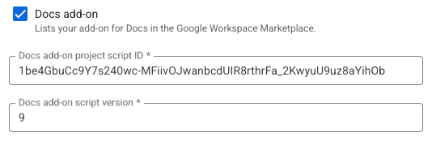

# Dev info

`clasp login`

`clasp open-script .`

`clasp push`

## How to release new version

> Thanks to https://github.com/FUSAKLA/gdocs-songbook/ for summmarizing this

1.  Commit all the changes and push them to main
2.  Run `npm run push`
3.  Run `npm run open`
4.  In upper right corner `Deploy` and `NewDeployment`, name it using semver compared to the previous deployments (the name actually doesn't mean anything i suppose :roolling_eyes: )
5.  Tag the git repo vith the same semver as `git tag v1.4.0 && git push origin v1.4.0`
6.  Go to `Deploy` and `Manage deployments`
7.  Choose the deployment you just created and scroll down to the `Library` -> `URL`, in the end of the URL is a number **which is the one important**.  
    Example, `9` in the following url : https://script.google.com/macros/library/d/1be4GbuCc9Y7s240wc-MFiivOJabcdUIR8rthrFa_2KwyuU9uz8aYihOb/9
8.  Go to https://console.cloud.google.com/apis/api/appsmarket-component.googleapis.com/googleapps_sdk?project=chords-grid-crafter and update the `Docs Add-on script version` to the number obtained in the previous step.  
    
