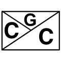
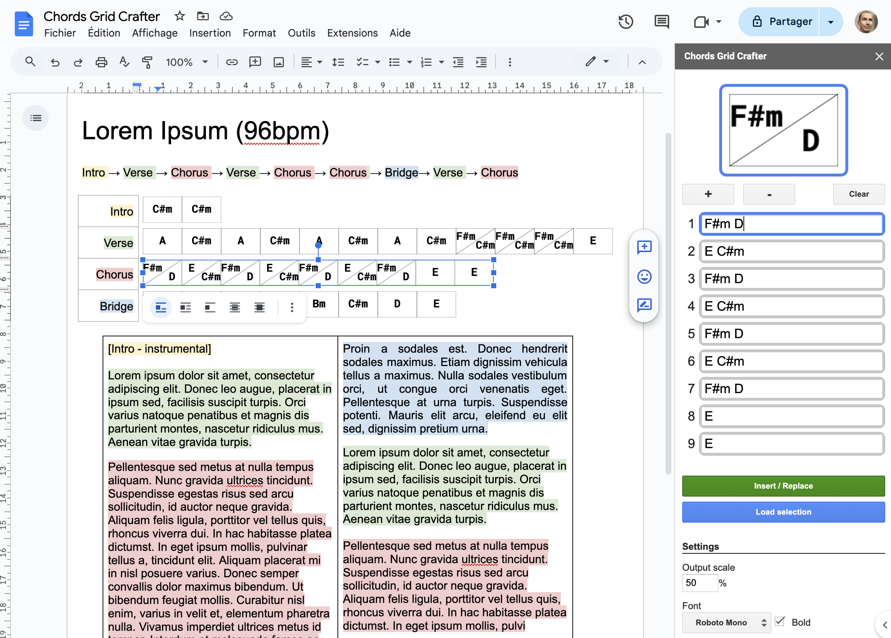

#  Chords Grid Crafter ‐ Google Docs Add‐on

A Google Docs add-on to help you write and maintain your musinc using the [Chords Grid notation](https://en.wikipedia.org/wiki/Chord_chart#Grid_notation).

Install it from the [Google Workspace Marketplace]() and have a look at the [documentation](https://github.com/the8tre/gdocs-chords-grid-crafter/wiki)

