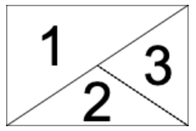

#  Chords Grid Crafter ‐ Google Docs Add‐on

## Motivation and description
The Chords Grid notation is a very useful tool when you want to make sure all members of your band are aligned on what they should play. You can learn more [here](https://en.wikipedia.org/wiki/Chord_chart#Grid_notation) and [here](https://www.imusic-school.com/blog/fr-guitare/debuter-guitare/grille-accords/)

This add-on is meant to help you to write and maintain your Chords Grids straight from your Google Docs document.  
It outputs your grid into the document being edited and let's you re-edit it later if you need to bring some changes.

 

## Install it
Just install it from the [Google Workspace Marketplace](https://workspace.google.com/marketplace/app/chords_grid_crafter/288629459826)

## Run it
The add-on can be used from any opened Google document in the menu `Addons -> Chords Grid Crafter -> Show panel`. This will open a sidebar with all the functionality provided.

## Use it
Each input field represents 1 bar of your music.  
Enter your chords into the text field and separate them with a space.  
 
You can enter up to 4 chords per bar which will be automatically arranged into the grid as follows:
| Chords count  | Preview                                                   | Details                                                                                                                                                      |
| ------------- | --------------------------------------------------------- | ------------------------------------------------------------------------------------------------------------------------------------------------------------ |
| 1             |       |                                                                                                                                                              |
| 2             |      |                                                                                                                                                              |
| 3             |      |                                                                                                                                                              |
| 3 alternative |  | When you entered 3 chords you can select an alternative split of the bar using the dedicated button:  |
| 4             |      |                                                                                                                                                              |

Once you're done with this first bar click the `+` button or hit the `[Enter]` key to add a new row and start editing it:  

> [!TIP]
> You can navigate through the rows using your keyboard arrow key up/down.

Once you're done entering all you bars you're ready to insert it into your document. Place the cursor in the document where you want to insert your drid and click the `Insert / Replace` button:  
| Input                                               | Result                                                   |
| --------------------------------------------------- | -------------------------------------------------------- |
|  |  |

### Re-edit an existing Chords Grid
If you need to make some changes to a Chords Grid you previously created simply select it in your document and click the `Load selection` button.  
The editor will be populated with the content of your grid, keeping track of all initial settings (scale, font etc).  

## Settings

### Shape
Choose to render each cell of the grid as:
- A square
  - 
- A Rectangle
  - 

### Font
Choose the output font from the dropdown.  
The font is used both in the preview panel and when inserting in the document.

### Chords reading order
Choose from dropdown whether the chords should be read clockwise or not:
- Clockwise
  -  
- Non-clockwise
  -  

### Output scale
Scales the grid to the specified percentage.

## Issues or ideas for improvement
The plugin is just a hobby project of mine and is non-profitable. The code is open source and can be found [here](https://github.com/the8tre/gdocs-chords-grid-crafter) on GitHub. It does not collect any data of yours or read documents outside the document being edited. If you have any idea for improvement or encounter any issue, please let me know, and I’d be happy to resolve it if my time schedule allows me to.
