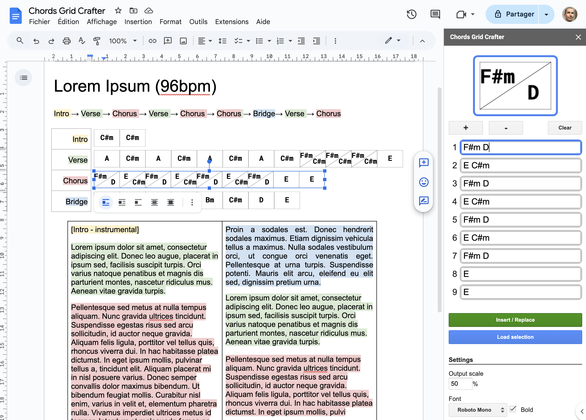

## Description and motivation
This add-on is meant to help you create and maintain your Chords grid notation as it's described [here](https://en.wikipedia.org/wiki/Chord_chart#Grid_notation)

## How to install it
Just install it from the [Google Workspace Marketplace]()

## How to run it
The add-on can be used from any opened Google document in the menu `Addons -> Chords Grid Crafter -> Show panel`. This will open a sidebar with all the functionality provided.

## How it works
The add-on let's you write all the chords that make your grid and then inserts the grid as an image into the document being edited. The generated image holds the full grid description allowing for it to be edited again later.

## Settings
### Output scale
Scales the grid to the specified percentage.

### Font
Choose the output font from the dropdown. The font is used in the preview panel at the some.

### Chords order
Choose from dropdown whether the chords order is applied clockwise or not.

## Issues or ideas for improvement
The plugin is just a hobby project of mine and is non-profitable. The code is open source and can be found [here](https://github.com/the8tre/gdocs-chords-grid-crafter) on GitHub. It does not collect any data of yours or read documents outside the document being edited. If you have any idea for improvement or encounter any issue, please let me know, and I’d be happy to resolve it if my time schedule allows me to.
